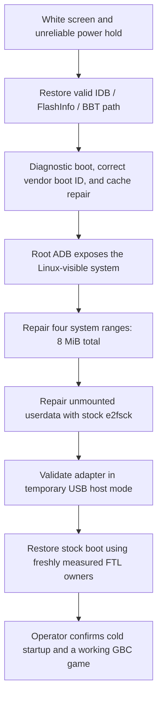

# Retro Freak RF-1 recovery research

[](https://github.com/LordVitaly/retrofreak-rf1-repair-research/actions/workflows/validate.yml)
[](LICENSES/MIT.txt)
[](LICENSES/CC-BY-4.0.txt)

**A documented recovery from white screen and failing power hold to a working console.**

An early **Retro Freak RF-1 / Rockchip RK3066 / 4-GiB Micron NAND** was recovered
through boot-chain diagnosis, filesystem repairs and restoration of stock USB
behavior. This project preserves the findings, evidence, failed attempts and
research tools so future repairers do not have to rediscover the same problems.

**Observed outcome:** normal startup after complete power removal, working HDMI
and GUI, cartridge adapter, controller and the same Game Boy Color game. Settings
persistence was checked during earlier working-state restarts. See [Status and
validation limits](STATUS.md) for exactly what was measured and when.

[Start diagnosing](docs/DECISION_TREE.md) · [Read the recovery story](docs/SUCCESSFUL_RECOVERY_PATH.md) · [Browse the evidence](docs/EVIDENCE_MAP.md) · [Download the latest release](https://github.com/LordVitaly/retrofreak-rf1-repair-research/releases/latest)

## Acknowledgements: where this repair began

Earlier community research gave this repair its essential starting points:

- **Ken / Sui Lab** [documented using a RetroN 5 recovery SD image on Retro Freak](https://sui-lab.info/archives/3342) in January 2021. That article motivated our initial recovery attempt. The recovery image itself came from the RetroN 5 full-reset package; Ken is credited here for documenting its application to Retro Freak.
- **Anonymous 5ch contributor `f0xHXxH1`, post #10**, [recorded the hidden service switch and PC connection sequence](https://medaka.5ch.io/test/read.cgi/gameurawaza/1447594308) in November 2015. This was the critical reference for finding our service entry path. We subsequently confirmed Rockchip RK3066 MaskROM (`2207:300A`) on the investigated RF-1; the retained description of the original post did not explicitly identify MaskROM. The attribution comes from the research-session record and could not be independently re-fetched during publication review.
- **hissorii / [retrofd](https://github.com/hissorii/retrofd)** provided foundational research on Retro Freak's Android internals, SD boot, NAND partitions, ADB and USB/OTG behavior that helped make further diagnosis possible.

These contributions made the investigation possible. See [Sources and credits](docs/SOURCES_AND_CREDITS.md) for the full attribution record, including nosuke, Duddyfinger, the original recovery-image provenance and other upstream projects.

## Find the right starting point

| Your goal | Read first |
|---|---|
| Understand a white screen, splash hang or failed power hold | [Decision tree](docs/DECISION_TREE.md), then [safety and scope](docs/SAFETY_AND_SCOPE.md) |
| Follow the repair from failure to a playable game | [Successful recovery path](docs/SUCCESSFUL_RECOVERY_PATH.md) |
| Study NAND, FTL, BBT and the vendor boot digest | [Technical report](docs/TECHNICAL_REPORT.md) and [address spaces](docs/ADDRESS_SPACES.md) |
| Check the evidence behind a claim | [Evidence map](docs/EVIDENCE_MAP.md) and [project status](STATUS.md) |
| Reuse the research code | [Tooling guide](docs/TOOLING.md), [tool index](toolkit/INDEX.json), [license scope](LICENSE_STATUS.md) |
| Learn from the wrong turns | [Postmortem](docs/POSTMORTEM.md) |
| Locate the hidden service button or inspect this board | [Board photographs and MaskROM button](docs/BOARD_PHOTOS.md) |
| Identify the firmware used in this case | [Firmware reference](docs/FIRMWARE_REFERENCE.md) and [reference hashes](docs/REFERENCE_HASHES.md) |

## The recovery, at a glance

The sequence below is the history of this one unit, not a mandatory sequence for
another console. Each step had its own diagnosis and verification.



| Finding | Why it mattered |
|---|---|
| Early geometry and FlashInfo selection could be wrong | NAND reads could succeed while the boot parser rejected their contents |
| Early and full FTL views could choose different boot owners | A successful readback through one path did not prove what normal boot used |
| Modified boot required the vendor-specific SHA-1 ID | A correctly written diagnostic image could still be rejected |
| Live Linux saw four damaged system blocks | The actual OS view isolated an 8-MiB repair after earlier loader-level work |
| Userdata became read-only after filesystem errors | Repairing the unmounted filesystem allowed Android to finish startup |
| Diagnostic ADB changed one port's USB role | Restoring stock boot returned normal adapter behavior after power removal |

The origin and timing of every corruption event were not established. Functional
success does not prove the health or endurance of every NAND cell. Final stock
boot readback happened before the last power removal; the following cold-start
result was an operator-reported functional test, not a new full NAND read.

## Before using the tools

**RAM-loaded code can still write NAND during initialization.** A command called
read or download does not by itself establish a read-only session. Read the
[hidden-write findings and boundaries](docs/SAFETY_AND_SCOPE.md) first.

The 456 historical sources are deliberately inert `.txt` snapshots. Physical
owners, mappings, page ordering and write guards were specific to the recorded
sessions. Do not rename and run them against another unit. The maintained
[local boot-ID checker](toolkit/offline/README.md) and publication tests work on
local files without a console.

## Materials included

- [Board photographs](docs/BOARD_PHOTOS.md): seven full-resolution owner-supplied images, including the marked service button, both board sides and connector orientation.
- [Documentation](docs/README.md): diagnosis, successful path, pitfalls and references.
- [Evidence](evidence/README.md): selected redacted results linked to the claims.
- `toolkit/phase1_20260903/` and `toolkit/phase2_20260908/`: 456 preserved source snapshots.
- `toolkit/offline/`, `scripts/`, `tests/`: local checker, publication maintenance and synthetic tests.
- [Third-party references](third_party/DEPENDENCIES.md): acquisition metadata and preserved notices.
- [Provenance](provenance/PUBLICATION_UPDATE_2026-09-13.md): source editions and publication corrections.

Private NAND/RAM images, saves, ROMs, keys, device serials, complete device maps,
commercial APK/SO files and vendor firmware binaries are excluded. The public
archive is a research resource; it is not a complete private rollback backup.

## Verify the download

Python 3.10+ and its standard library are sufficient. No device is required:

```sh
python -B scripts/check_repository.py
python -B -m unittest discover -s tests -v
python -B scripts/verify_manifest.py
```

[Validation](docs/VALIDATION.md) explains the manifest, line endings and test
scope. GitHub Actions runs publication checks and synthetic tests only.

## Help future repairs

Corrections, observations from other revisions and safer diagnostic approaches
are welcome. Start with [Contributing](CONTRIBUTING.md); report your evidence and
its limits, and keep private dumps and identifying data out of public issues.
Earlier Japanese research and upstream projects are credited in
[Sources and credits](docs/SOURCES_AND_CREDITS.md).

## Reuse and attribution

Our original code is **MIT-licensed**; our original documentation is **CC BY 4.0**.
Third-party material retains its own terms. See [license scope and attribution](LICENSE_STATUS.md).
This is an independent community research project, not a manufacturer-supported
service or a universal flasher.

## Maintainer's note and AI assistance

I am not a programmer. This repair began with assistance from **GPT-5.6 Sol** and
continued with **GPT-6 Astra**. This GitHub repository and its documentation were
prepared with assistance from **GPT-6 Astra**. I performed the physical actions
and reported the console's behavior during the investigation.

I am sharing the material **as is** and have tried to preserve as many useful
details, findings, tools and failed attempts as possible for future repairers.
AI assistance does not make every explanation correct or turn this case into a
universal repair procedure. The evidence and its limits are documented throughout;
corrections supported by observations are welcome.
