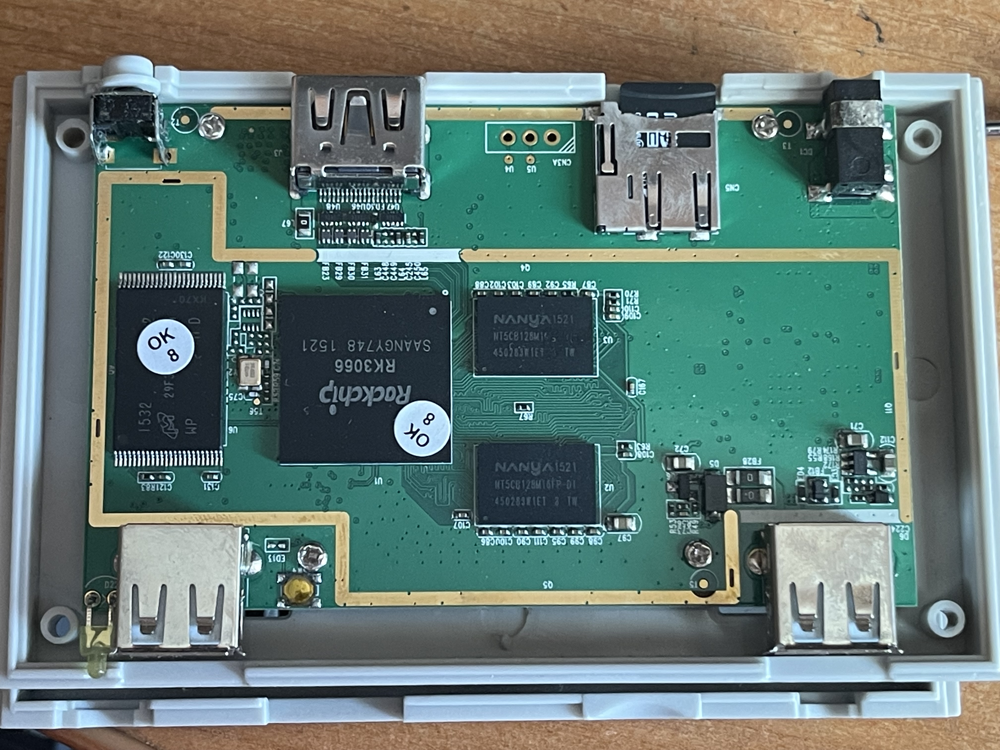
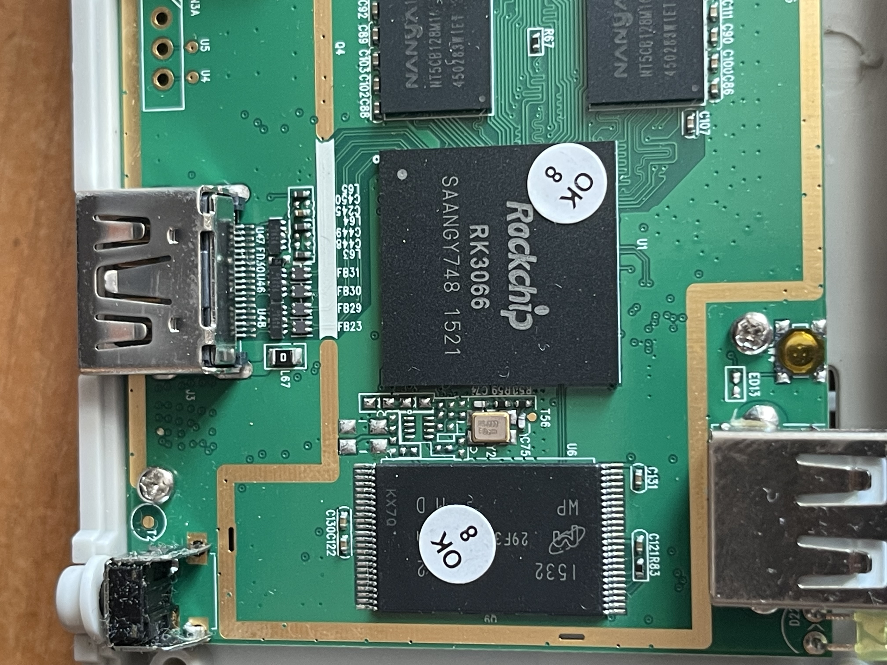
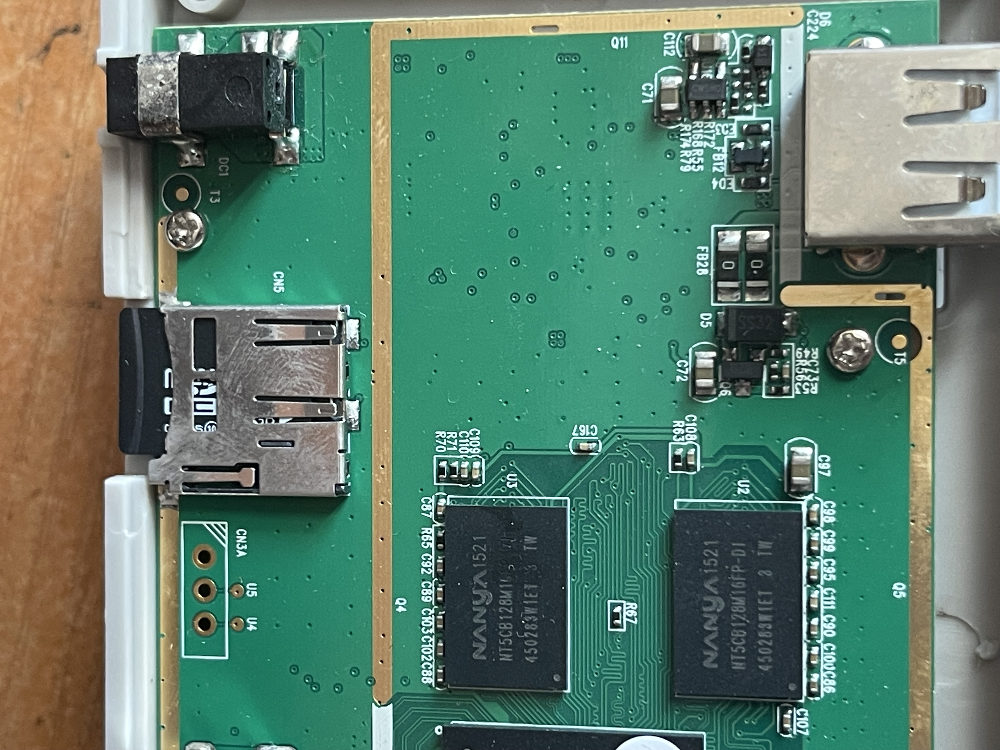
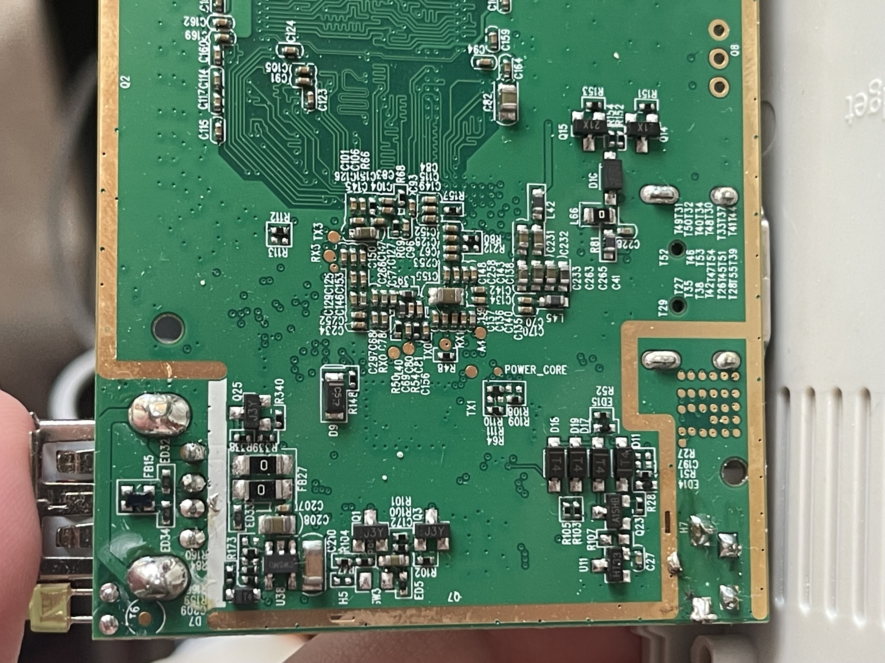
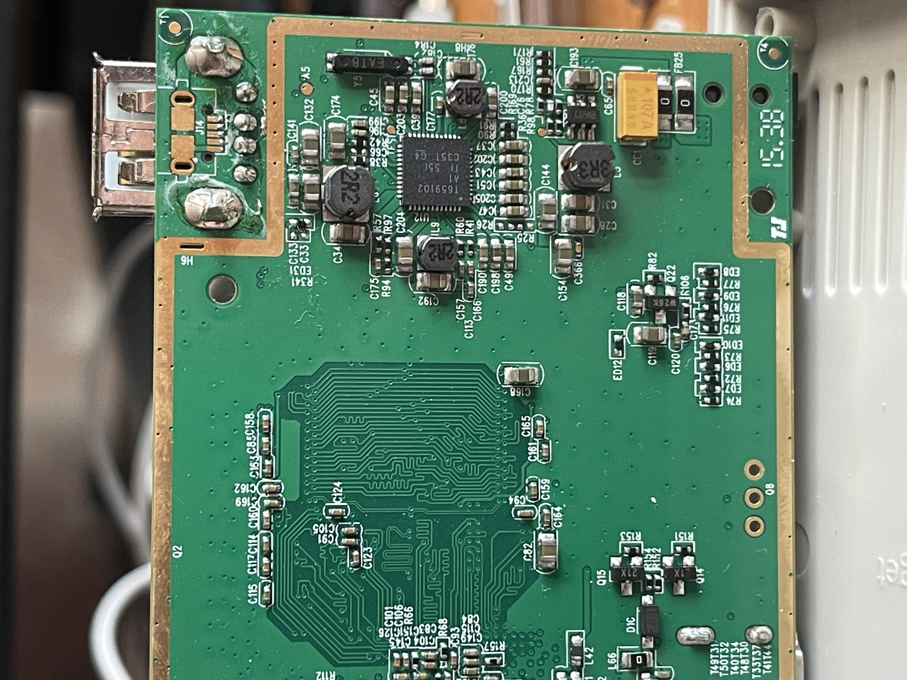
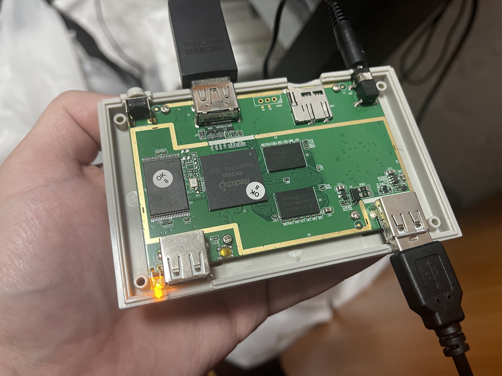

# RF-1 board photographs and the hidden service button

These photographs were supplied by the owner of the RF-1 investigated in this
repair. They document this board, not every Retro Freak revision. Click a photo
to open the full-resolution file. The original capture dates are not asserted.

## Hidden service button used for MaskROM entry

The owner's red arrow and circle identify the **yellow tactile pushbutton** used
for MaskROM entry in this case. We call it the **hidden service button (MaskROM
entry)**; this is a descriptive name, not a verified manufacturer part name or
schematic signal label. It is a pushbutton, not a latching slide switch.

In this photograph the two front USB sockets are at the top. The button is just
inboard of the socket on the right of the image, beside the socket closest to the
LED. The opposite USB socket is on the left of the image. These are image-relative
positions, not universal left/right port names when facing an assembled console.

The hidden-switch and PC-connection sequence came from the earlier 5ch reference
credited in [Sources and credits](SOURCES_AND_CREDITS.md). During this repair,
using that path produced USB ID `2207:300A` and a Rockchip MaskROM identification.
The photograph locates the button; the USB observation establishes the mode.
See [Technical report, section 4](TECHNICAL_REPORT.md#4-hidden-service-switch-and-maskrom)
for the recorded result and [Safety and scope](SAFETY_AND_SCOPE.md#power-and-usb-roles)
before attempting any physical connection. The photos do not establish the
electrical safety of arbitrary USB cables or the wiring of other revisions.

## Board overview without annotation

The component side shows the RK3066, two Nanya memory packages, the Micron NAND
package, front USB sockets and rear connectors. This unannotated view is retained
alongside the owner's marked version for inspection.

## SoC, NAND and service-button detail

Close view of the `Rockchip RK3066` marking and adjacent Micron NAND. Inspection
stickers partly cover the packages; a complete NAND part number cannot be read
from this photo alone. The yellow service button is visible above the SoC.

## Memory, USB and DC-input side

This view records the memory packages and components near the other front USB
socket, with the DC input and microSD slot at the lower edge of the image.

## Underside and labelled contact pads

Labels including `RX0`, `TX0`, `RX1`, `TX1`, `RX3`, `TX3` and `POWER_CORE` are
visible. These are photographic observations of silkscreen labels. This page
does not establish a tested UART pinout, voltage level or usable debug console.

## Underside power-management area

The power-management area and surrounding components are visible here. Their
appearance is not evidence of a hardware fault or a complete electrical test.
The documented repair did not establish a failed PMIC as the original cause.

## Connected board and port orientation

The board is turned relative to the overview. The LED and service button are now
beside the lower-left USB socket; the USB cable occupies the opposite, lower-right
socket. HDMI and DC power are also connected. A lit LED and attached cables do
not by themselves prove MaskROM, Android startup or a successful repair. This is
a historical setup photo, not a recommendation to handle a powered bare board.

## Attribution, processing and privacy

Photographs and the red-arrow annotation: **LordVitaly**. Published as original
project documentation under [CC BY 4.0](../LICENSES/CC-BY-4.0.txt).

All seven files retain their original 4032 by 3024 stored pixel dimensions;
portrait photos use a minimal orientation tag for display. Publication preparation
removed camera metadata, comments, embedded auxiliary metadata and trailing data.
Only the EXIF orientation tag remains. The primary compressed image data and
decoded pixels were verified unchanged; no generative retouching was used.
No explicit console serial labels or personal text were identified during visual
review. Component markings and incidental hands/background remain visible.

The [photo catalog](assets/board/PHOTOS.json) records published filenames, sizes,
hashes and orientation. It contains no private source paths or capture metadata.
The repository checker verifies the reviewed hashes and rejects additional JPEG
metadata. Pixel-level visual review remains a human/editorial responsibility.
