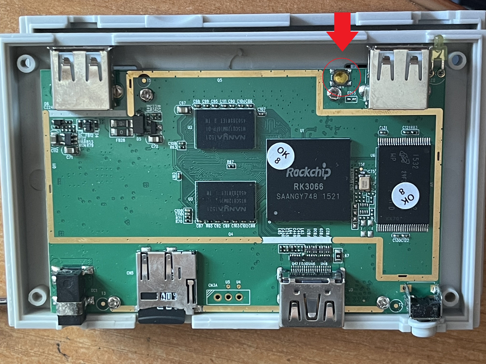

# Technical report: Retro Freak RF-1 white-screen recovery

## 1. Platform and reference firmware

The investigated RF-1 is an early Rockchip RK3066 unit with Micron parallel NAND.

Observed NAND parameters in the successful geometry path:

- NAND ID: `2C 44 44 4B A9`
- capacity: 4 GiB
- 2048 physical blocks
- 2 MiB per physical block
- 8 KiB native page
- 256 pages per block
- ECC40 in the normal data path
- ECC24 / MLC low-page ordering in the IDB boot path
- 1896 logical blocks after the FTL's reserved area

The verified official update used during analysis corresponds to:

- application 1.5
- system software 0.2.0
- build resource 2764
- RK3066
- official `system.img` size: 155,185,152 bytes

The official update package was independently parsed as:

`ZIP -> encrypted Retro Freak container -> Rockchip RKFW -> RKAF -> boot/recovery/system/parameter/update-script`.

## 2. Initial symptoms

The case began with three overlapping symptoms:

1. persistent white HDMI screen during normal boot;
2. intermittent failure to hold power after the Power button was released;
3. a recovery-SD path that worked once and then stopped being selected.

A factory reset from Retro Freak Recovery System v1.1 did not resolve the white screen.

## 3. Recovery-SD investigation

The initial recovery method came from Japanese community work using the RetroN 5 full-reset SD image. A correctly imaged SD card reproduced the expected partition table and payload. Later marker tests modified only `/data/bootscript.sh` so execution would create a marker file before requesting recovery.

After repeated cold/warm attempts:

- the hidden ext partition remained byte-identical;
- the marker file was never created;
- no persisted evidence of the marker was found in those attempts.

This is consistent with a failure before the BOOTSD/bootscript path, such as the branch not being selected or `/dev/block/mmcblk0` being unavailable at the required early point. Marker absence alone does not prove that the script was never entered: an unsuccessful marker write or persistence failure was not independently excluded.

## 4. Hidden service switch and MaskROM

A 2015 Japanese 5ch post described a hidden switch near one front USB port and a PC connection sequence using the other port while applying power. Repeating that procedure on the reference RF-1 produced Rockchip USB ID `2207:300A` and a MaskROM state.

This was the key escape hatch: it provided a boot-ROM-controlled service path independent of Android, recovery and the installed NAND boot chain.

The owner's [board photographs and marked service button](BOARD_PHOTOS.md)
show the yellow tactile pushbutton and connector orientation on this RF-1.



## 5. NAND backup and representation pitfalls

The first full acquisition used a Rockchip `RS` path that returned records of 528 bytes:

- 512 bytes main data;
- 16 bytes auxiliary/service data.

A complete 4 GiB main-data space therefore occupied 4,429,185,024 transport bytes. This format is **not** a linear partition image and must not be written back as one.

Important representation distinctions discovered during the work:

- normal ECC40 data path vs IDB ECC24 boot path;
- physical NAND addresses vs logical FTL addresses;
- early mode0 vs full mode1 FTL views;
- main data vs the limited meaningful auxiliary `u16` visible through the investigated interface;
- boot-order low pages vs linear physical page numbers.

Confusing these address spaces caused several early false conclusions.

A later audit also found that the original unguarded USBplug initialization could
run an erase/program geometry probe (`0x6D7C -> 0x4230` in the investigated code).
Therefore the early statement “only DB/RID/RFI/RS were sent, so NAND could not have
changed” is not established by command names. Tested guarded variants and their
counters provide narrower evidence. This does not identify who or what caused
the original corruption; see [Safety and scope](SAFETY_AND_SCOPE.md).

## 6. Early concrete `/system` corruption evidence

Before live Linux was available, the raw/FTL investigation already showed real filesystem damage:

- a cached ext superblock recorded 22 filesystem errors;
- inode 671 matched the official `/system/bin/vold` inode;
- the inode itself matched the official inode structure;
- its singly-indirect block was 1024 bytes of `FF`, yielding `0xffffffff` pointers;
- directory data under `/system/bin` also differed from the official image.

This proved real corruption but did not yet prove the complete active mapping used by normal boot.

## 7. Why an early “full system rewrite” was not the final proof

An original FlashBoot FTL writer was modeled and eventually exercised through a RAM bridge. A complete official system rewrite could be read back exactly through the diagnostic FTL path, including after FTL reopen. This demonstrated that the writer and FTL logic could work.

Later live Linux showed four bad system blocks. Different active owners in early and full FTL views were directly measured for boot, but the records do not establish the timing or cause of each later system defect. Mapping changes are a relevant mechanism, not a proven explanation for every discrepancy. A successful loader-level readback cannot be generalized to a later ordinary boot; the actual Linux-visible data must be checked.

## 8. Early power-hold failure: geometry, FlashInfo and BBT

The persistent power symptom was ultimately tied to early NAND initialization state rather than a proven independent PMIC hardware fault.

The original NAND-init flow initially searched IDB candidates with a 1 MiB stride. A valid header then reported a 2 MiB block size, but the candidate index was not recomputed. On the reference unit a candidate found at physical sector `0x5000` had index 10 under the old geometry. After block-size discovery, FlashInfo reads were therefore directed to `0xA770` / `0xA3D0` instead of the intended `0x5770` region. The native reads themselves could return success while the parser rejected the all-FF/non-FlashInfo content.

A RAM-only control changing only the initial block-size assumption redirected the FlashInfo access to `0x5770`, where the original parser accepted the data and recovered the correct `0x00800000`-sector capacity (4 GiB / 2048 physical blocks). This experiment established the geometry mechanism without making that patch the permanent repair.

The durable repair restored an original IDB in physical block 0 so the correct index/geometry relationship existed naturally. BBT12 was then restored. After a true power cycle, the unmodified FlashBoot path accepted the geometry and BBT without RAM substitutions. Stable normal power hold returned.

## 9. BBT corruption pattern

The bad-block table copies had correct main data but three wrong auxiliary values: observed `FF70, FFFF, FF70` where the valid structure required `0768, 0000, 0768`. The wrong logical-block count derived from this state was 65392 rather than 1896.

A constrained ARM replay showed a plausible mechanism: with an invalid fallback capacity yielding zero physical blocks, subtraction/reservation arithmetic could produce `-144`, whose low representation explains `0xFFFFFF70` / `FF70`. This reproduces the specific pattern but does **not** prove when or by whom the original corruption occurred.

## 10. Diagnostic boot and the vendor boot ID

To obtain early ADB, a diagnostic boot image was prepared. Initial writes appeared correct through one FTL view but normal boot still did not execute the modified ramdisk.

Two independent problems were found:

1. normal boot and the full FTL could select different physical boot owners;
2. the modified boot image retained the old 32-byte ID even though the ramdisk changed.

The original FlashBoot ARM verifier was reverse engineered and used as the authority. For the observed `ANDROID!` image the ID calculation is:

```text
SHA1(
    kernel[0:kernel_size] || LE32(kernel_size) ||
    ramdisk[0:ramdisk_size] || LE32(ramdisk_size) ||
    second[0:second_size] || LE32(second_size) ||
    header[32:576]
) || 12 zero bytes
```

The result is compared with `header[576:608]`. The stock image passed, the first modified image failed, and the corrected diagnostic image passed the actual ARM verifier.

## 11. `/cache` repair and root ADB

`/cache` contained a recognizable ext filesystem but damaged directory/journal state. A clean compatible 64 MiB filesystem was built and checked offline. Only the filesystem-allocated regions in the first 6 MiB were required for the repair; a block already matching the intended zero content was not rewritten.

After this stage the normal system enumerated over USB as Retro Freak (`2207:0006`). The historical ADB client required vendor ID `0x2207` in its `adb_usb.ini`. Root ADB then became available.

## 12. Live Linux isolated the real active `/system` damage

With working Linux/ADB, `/dev/block/mtdblock8` was read in full and compared with the official system image. This eliminated ambiguity about which physical copies the kernel actually used.

Exactly four active 2 MiB logical blocks were damaged:

- 192 at offset 12,582,912
- 195 at offset 18,874,368
- 198 at offset 25,165,824
- 204 at offset 37,748,736

The damaged regions contained large FF-like/repeated structural content and affected graphics/framework data, including the library path that prevented `libGLESv1_CM.so` from being loaded as a valid ELF.

Only those four ranges (8 MiB total) were repaired while `/system` was truly unmounted and Android services were stopped. After sync/cache drop and cold boot, the repaired blocks, GUI APK and GLES library matched their references. The white screen disappeared and the boot advanced to the Retro Freak splash screen.

## 13. `/data` was the next independent failure

The splash-screen hang had a new cause. Kernel logs showed userdata bitmap/group-descriptor inconsistency, journal abort and a read-only remount. Android could not create `/data/system/...` and required databases, causing SystemServer failure.

A full userdata backup was made first. `e2fsck` was tested on an offline copy before the real device was touched. The live repair used the stock static filesystem checker on an unmounted `/dev/block/mtdblock6`, followed by a clean read-only check and a small RW create/read/delete probe.

No userdata format was required. After this repair the GUI completed startup, `/data` and `/cache` were writable and settings persisted.

## 14. Restoring USB host behavior and stock boot

The diagnostic boot forced the PC-facing port into USB device/ADB mode. A temporary RAM-only change verified USB host behavior, the cartridge adapter, controller input, accessory firmware update, Game Boy Color cartridge detection, save import and game launch.

Before permanently restoring stock boot, fresh mode0/mode1 maps were captured. The current active physical owners were different from some historical addresses recorded earlier. Only the freshly measured owners were used. Native main and meaningful auxiliary data were captured per target block, each write was guarded, and both FTL modes were checked afterward.

The final stock-boot verification matched the prepared stock source across the relevant boot region, including the preserved tail outside the official boot payload.

## 15. Final validation

After complete removal of power and PC USB, the operator confirmed normal startup with stock boot, the adapter, controller and the same Game Boy Color game. Across the repair, the following results were established at the indicated stages:

- stable power hold;
- GUI and HDMI;
- settings persistence during the earlier working-state restarts;
- controller;
- cartridge adapter;
- Game Boy Color cartridge detection;
- save import during the temporary host test before stock-boot return;
- game launch.

Final binary readback preceded the last power cycle; the following cold-start result is a functional observation, not another full NAND comparison. Save import was observed before stock boot was restored. Three startup NAND diagnostic dumps and a readahead restart noted in an earlier working-state log remain unclassified; a later absence or resolution was not demonstrated. The final functional success does not prove every NAND cell or all peripherals healthy.

## Evidence and validation boundaries

The [evidence map](EVIDENCE_MAP.md) links the material behind these conclusions.
The early full-system rewrite, the later Linux four-block repair and the final
stock-boot return are separate events. Sources retain unsuccessful attempts and
host-check errors; they must not be combined into a fictional single flawless
flash operation. No new device testing was performed to prepare this repository.
